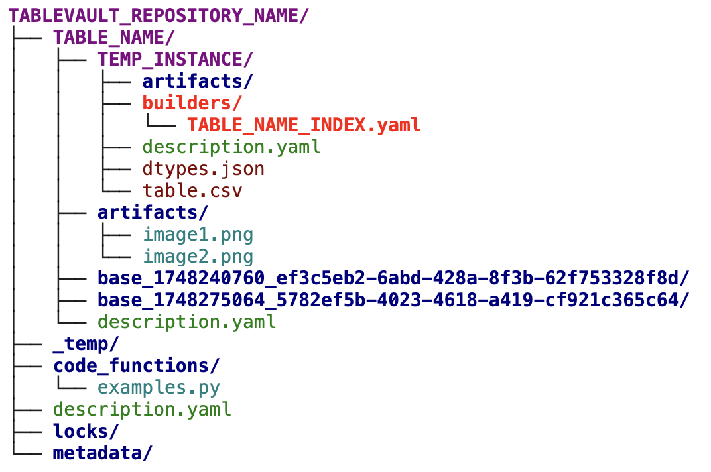

# Builders, Python Functions, `TableReference` Strings, and Artifacts

TableVault instances are typically constructed and modified through a series of orchestrated steps. At the heart of this process are builders files, which are configuration files that define the scope of data transformations, and Python files, which define the data transformation itself. This construction uses `TableReference` strings to link fetch data from previous instances, and can optionally generate TableVault artifacts to store arbitrary files. 

Execution of instances typically are initialized with the `execute_instance()` function. Alternatively, to bypass the process, you can also externally generate your dataframe and artifacts, and add them into your TableVault repository using the `write_instance()` function. This is not typically recommended since execution and data lineage information is lost. 

---

## Builders

Every table instance executed by TableVault possesses its own set of builder files. You can add builders to a temporary instance by copying them from a previous origin instance, specifying builder names during `create_instance()`, or using the `create_builder_file()` function. Each builder uniquely modifies a set of specified columns in the resulting dataframe. This is specified by the mandatory `changed_columns` field.

Builders do not contain the data transformation logic themselves. Instead, they point to the Python functions that perform the actual work. This connection is established through the `python_function` and `code_module` fields in the builder's YAML file.

  * `code_module`: This field specifies the Python file containing the transformation function. This module must be added to TableVault using `create_code_module()`.
  * `python_function`: This is the name of the function within the `code_module` that will be executed. This function receives the arguments defined in the `arguments` section of the builder file.


When executing an instance (with the `execute_instance()` function), TableVault first runs the `IndexBuilder` configuration to generate the initial set of rows. Subsequent `ColumnBuilders` builders are executed based on internal column dependencies. These dependencies are automatically extracted by parsing for `<<self.COLUMN_NAME>>` Table Reference values in each file. Note that cyclic dependencies will result in an error.

!!! note "Data Caching"
    If the executing instance is copied from a previous instance, TableVault reuses data unless disabled by setting `force_execute` to be `True` in `execute_instance()`. If the builder file, code file, and table dependencies have not changed from the previous instance, **the rows with the same primary key columns** are directly duplicated from the origin instance.

**Physical Location**

{ width=60%}
/// caption
**TableVault Builders Location**
///

---

## Custom Python Functions 

Python functions execute the logic defined by builders. They reside in the repository-level `code_function/` directory. You can create or copy Python files into this folder using `create_code_module()`. Once created, they are editable directly.

Functions must adhere to specific contracts:

  * **`dataframe`**: Return a complete `pd.DataFrame`.
  * **`row-wise`**: Return a single row.
  * **`generator`**: Yield rows for streaming into DataFrames.

For successful execution, all required input arguments for the Python function must be defined in the builder file.


**Physical Location**

{ width=60%}
/// caption
**TableVault Code Folder Location**
///

---

## `TableReference` strings

`TableReference` strings enable you to dynamically pull data from any active instance to configure your builder files.

Instead of hard-coding values in the file, you can use a special `<< ... >>` syntax to fetch information from tables, making your configurations more flexible and automated. For example, you can use a reference to:

  * Pull a specific setting from a central configuration table.
  * Get a list of column names to be generated.
  * Look up a value from another table based the index of the current row being processed.

You can specify which table to query, filter for specific rows, and select the exact columns you need. References can even be nested to handle complex, multi-step lookups. The system automatically retrieves the data—whether it's a single value, a number, or a list—and inserts it into your configuration where the reference was placed.

**Examples**

Here is a simple example showing a `TableReference` string within a builder's arguments:

```yaml
# Example: Using a TableReference to get a configuration value
arguments:
  model_version: '<<config_table.value[setting_name::'prod_model_version']>>'
  api_key: '<<secrets_table.key[service::'external_api']>>'
```

-----

## Artifacts

In TableVault, an artifact is any non-dataframe file, such as an image, log, or serialized model, that is linked to a specific value in a table dataframe. This creates an organized and powerful connection between structured data and related unstructured files.

Artifacts are linked to specific instance or table folders. Temporary instances always contain its own isolated artifact folder; this folder is moved to a materalized location after the library validates that each artifact storied has a reference in its corresponding dataframe.

**Use Cases**

Artifacts support diverse applications:

  * **Machine Learning**: Store model checkpoints, performance charts, logs.
  * **Data Analysis**: Link invoices or detailed CSVs to summarized data.
  * **Computer Vision**: Associate metadata rows with images/videos.
  * **General Record-Keeping**: Store manuals, warranties, marketing documents alongside product data.

Retrieval is straightforward via the TableVault API: retrieving the base dataframe with `get_dataframe()` automatically generates the path to each stored artifact (relative to the base TableVault directory).

**Physical Location**

{ width=60%}
/// caption
**TableVault Artifact Folder Location**
///
