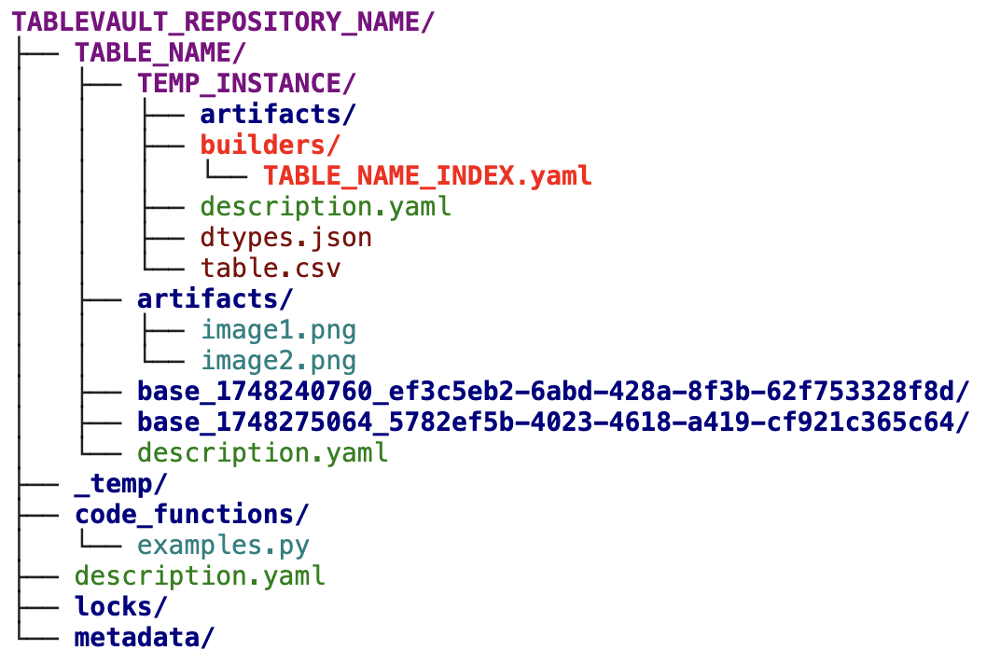
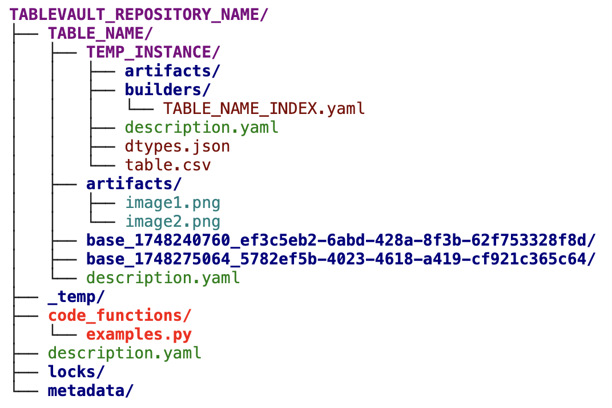
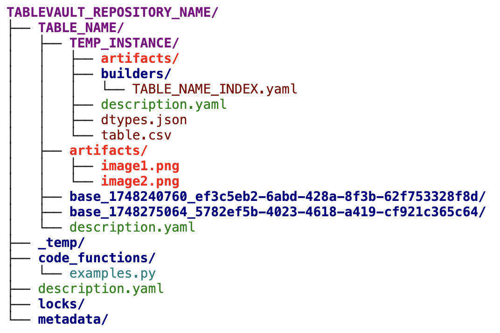

# Builders and Execution

Builders are YAML files that serve as blueprints for creating or modifying a table instance's DataFrame. They outline the steps for an instance's execution within TableVault. Unless the instance is written externally, it has a dedicated set of builders that can be created and modified while the instance is in a temporary state. This temporary state acts as a sandbox, allowing you to define and test your builders without affecting the final, materialized version of the table. These builders are then used to materialize the instance by applying the defined transformations.

---

## 1. Builders

### Physical Folder Setup


Every table instance possesses its own set of builder files. You can add builders to a temporary instance by copying them from a previous origin instance, specifying builder names during `create_instance`, or using the `create_builder` function.

{ width=60%}
/// caption
**TableVault Builders Location**
///

### Connecting Builders to Code

Builders do not contain the data transformation logic themselves. Instead, they point to the Python functions that perform the actual work. This connection is established through the `python_function` and `code_module` fields in the builder's YAML file.

    * `code_module`: This field specifies the Python file (e.g., `my_feature_lib`) containing the transformation function. This module must be added to TableVault using `create_code_module()`.
    * `python_function`: This is the name of the function within the `code_module` that will be executed (e.g., `build_features`). This function receives the arguments defined in the `arguments` section of the builder file.

    Here is a minimal example of a builder's YAML configuration:
    ```yaml
        builder_type: IndexBuilder

        changed_columns: ['fruits']        # Output columns
        primary_key: ['fruits']            # DataFrame primary key (optional)

        python_function: create_data_table_from_list       # Function to execute
        code_module: example_code                 # Module containing the function

        arguments:                               # Arguments passed to the function
            vals: ['pineapples', 'watermelons', 'coconuts']
        is_custom: true                         #using a user-supplied function in code_module
    ```

### Executing an Instance

When you execute an instance with `execute_instance`, TableVault reads the associated builder files. It begins with the `IndexBuilder` to create the initial DataFrame. Subsequently, it processes any `ColumnBuilder` files, with each calling its specified Python function to modify the DataFrame. Arguments for these functions—which can be scalar values, references to other table columns (`<<TABLE.COLUMN>>`), or special keywords like `~ARTIFACT_FOLDER~`—are passed from the builder file to the Python function. The execution sequence of the builders is automatically determined by the internal dependencies among the columns of the generated DataFrame (using the `self` keyword). Builder execution can be performed in a background Python process.

### Restarting an Execution

After each Python function returns a result, the output is saved within the instance folder. If the process is configured to be restartable, it will skip re-executing any steps with cached results.

---

## 2. Python Functions and the `code_function` Folder

### Physical Folder Setup


All user-provided Python code functions for the TableVault repository are stored in the `code_function` folder. You can create or copy files into this folder using the `create_code_module()` function. Once a file is created, it can be edited directly. During instance execution, builders retrieve the relevant function based on the specified file and function name and execute it in the same Python environment where TableVault is running.

{ width=60%}
/// caption
**TableVault Code Location**
///

### Code Function Specifications

Executed code functions can return two types of objects. If `row-wise` is `False` (the default), the function must return a pandas DataFrame containing all columns listed in `changed_columns`. If `row-wise` is `True`, the function must return a tuple of objects representing one row, with all the columns specified in the `changed_columns` list. Row-wise execution is highly efficient for transformations where each row can be processed independently, such as applying a complex scoring model or making an API call for each entry.

In the row-wise case, TableVault executes the function once per row (based on the DataFrame's state before that builder is executed) and efficiently consolidates the results using a map-reduce approach. The functions can be executed across multiple Python threads, as specified by the `n_threads` argument in the builder file.

For successful execution, all required input arguments for the Python function must be defined in the builder file.

***
*While Builders and Python functions define how to generate structured DataFrame content, your analysis often involves unstructured data. TableVault addresses this through Artifacts.*
***

---

## 3. Artifacts

###

TableVault can store data that is unsuitable for a traditional DataFrame as **artifacts**. An artifact can be any file, such as an image, a PDF report, a log file, a serialized model, or custom binary data, that you want to associate with your table's data. You can store artifacts at either the table level or the instance level by setting the `allow_multiple_artifacts` boolean argument during table creation. When an artifact is generated, it is first temporarily stored in the instance. After passing validation checks, TableVault moves it to permanent storage.

{ width=60%}
/// caption
**TableVault Artifact Location**
///

### Artifact Details

Each artifact is directly linked to a specific row in a table instance, creating an organized and powerful connection between structured data and related unstructured files.

### Usability of Artifacts

The primary purpose of artifacts is to enrich your dataset and centralize all relevant information. Here’s how they can be used:

* **Machine Learning**: A table of experiment results can have artifacts for each run, including saved model weights (`.pth`, `.h5`), performance charts (`.png`), configuration files (`.yaml`), or detailed logs.
* **Data Analysis and Reporting**: A table summarizing sales data could link to detailed PDF invoices or CSV extracts for each transaction.
* **GenAI and Vision**: A computer vision dataset could store the actual image or video files as artifacts linked to rows containing their metadata, labels, and features.
* **General Record-Keeping**: A table of product information can use artifacts to store product manuals, warranty documents, or marketing materials.

When you retrieve data from a table using the TableVault API, you can also obtain a direct, usable file path to any associated artifact. This allows you to seamlessly load and work with these files in your code—for example, displaying an image, parsing a log, or loading a model for inference—without needing to manage file storage locations yourself.

***
*Just as Artifacts link external files to your data, TableReferences provide a dynamic way to link data from other tables directly into your builder configurations.*
***

---

## 4. TableReferences

TableReferences enable you to dynamically pull data from any active instance to configure your builder files.

Instead of hard-coding values in the file, you can use a special `<< ... >>` syntax to fetch information from tables, making your configurations more flexible and automated. For example, you can use a reference to:

* Pull a specific setting from a central configuration table.
* Get a list of column names to be generated.
* Look up a value from another table based on data in the current row being processed.

You can specify which table to query, filter for specific rows, and select the exact columns you need. References can even be nested to handle complex, multi-step lookups. The system automatically retrieves the data—whether it's a single value, a number, or a list—and inserts it into your configuration where the reference was placed.

### Examples

Here is a simple example showing a TableReference within a builder's arguments:
```yaml
# Example: Using a TableReference to get a configuration value
arguments:
  model_version: '<<config_table.value[setting_name::'prod_model_version']>>'
  api_key: '<<secrets_table.key[service::'external_api']>>'
```

---