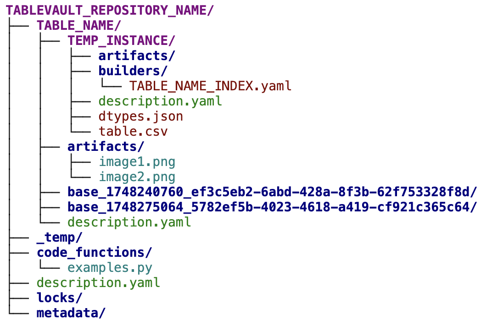

# Repository Structure

## 1\. TableVault Repository

Everything in a TableVault repository is stored and organized transparently within your local file system. This allows you to directly view all your data and the exact execution code using any interface application you prefer. Additionally, transferring your TableVault workflow to a new device is as simple as copying the relevant TableVault folder and setting up the same environment.

However, it is crucial to note that most *writes* to a TableVault folder must be done through the API to avoid breaking the system.

\!\!\! note "Builders and Code Files"
Builders and Python code files are the only two cases where direct edits using an external editor are permitted.

\!\!\! note "Unix Systems"
On Unix systems, we have set some files in TableVault to read-only to make this restriction more explicit. While this does not prevent malicious users, it can help prevent unintentional mistakes.

### Physical Folder Setup

The following diagram illustrates the internal storage structure of a TableVault repository:

{width=60%}
/// caption
**TableVault File Structure**
///

---

## 2\. TableVault Instance

A TableVault instance represents a dataframe with its associated metadata and optional artifacts. Physically, all files relevant to an instance are stored in a dedicated instance folder.

There are two types of instances:

**Temporary Instance.** This type of instance has not yet been executed and cannot be queried by the system. A temporary instance is created with the `create_instance` operation and contains various data, such as metadata, a description, and builder files (YAML files that specify how to construct the dataframe). You can specify whether an instance will be executed within the TableVault framework or populated from an external dataframe by using the `external_edit` parameter in the `create_instance` operation. If `external_edit` is set to `False`, the instance is prepared for execution using its internal builder files. If set to `True`, the instance is marked to be populated by an external process.

**Materialized Instance.** This type of instance has been executed (either by the system or externally) and is indexed by TableVault. The dataframe within a materialized instance is read-only; it can be deleted but not modified. If the instance is active (as determined by table properties), you can fetch its associated dataframe and select metadata using the TableVault API. The code functions and builder files used at execution are recorded where relevant. Materialized instances within the same table are versioned by a timestamp and, optionally, a user-specified `version` string.

---

## 3\. Table Folder

In TableVault, a "table" is more of a semantic abstraction than a concrete object. It is a collection of TableVault instances that can be referenced by the same name. All instances are encapsulated within a containing folder. In many TableVault API functions, the latest instance of a collection can be retrieved or queried using only the `table_name` reference, rather than its `instance_id`. In your file system, all instances belonging to the same table are stored together in the same folder.

Instances under the same table can share additional properties. During table initialization, if `allow_multiple_artifacts` is set to `False`, only the latest instance can be queried by TableVault, and only its indexed artifacts are stored. This is useful when you only want one active version of an artifact collection. If `has_side_effects` is set to `True`, all other instances of the same table become un-queryable the moment one instance begins execution. This is useful if your program performs an action that invalidates previous instances, such as changing the state of external storage.

Examples of tables include: a collection of instances testing different prompts for the same task, an instance tracking a repository of scientific papers, or evolving instances of an embedding model trained on different documents. You can add a free-form text description of a table by filling in the `description` argument in the `create_table` function.

---

## 4\. Metadata

A TableVault repository stores various metadata files. A detailed list of these files and their functions can be found in the [Advanced](https://www.google.com/search?q=) section.

---